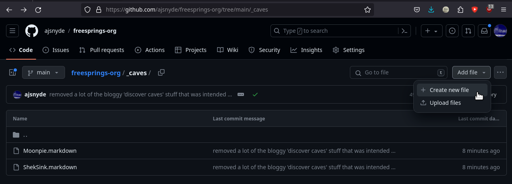

Welcome! The FreeSprings Project was an idea I had nearly a year ago, when browsing through [caveatlas.com](http://www.caveatlas.com/). It's a terrific tool, but most of the maps simply aren't available in decent quality, and the overall interface isn't easy to contribute to, so it's not going to really improve. As a software developer, one of my primary joys in life is to take something normally difficult/exhaustive and _lower the barrier to entry_ for others. That's why I created this site the way I did. The process to contribute is fairly straightforward:

If you want to add a cave, you'll need to create a single file [here](https://github.com/ajsnyde/freesprings-org/tree/main/_caves):

Then fill it in using the template (let's say it's called Shek Sink, which you can format as `ShekSink.md` in the filename) [here](https://github.com/ajsnyde/freesprings-org/blob/main/_drafts/ShekSink.md):

Then slam that commit button to open a pull request (pretty much asking me to review and add it to the website):

And eventually I'll (or maybe others) will review the newly created PR and add it to the [list of caves]({{ site.baseurl }})

Have images/files? I'm trying to keep this dead-simple for people not aquainted with Git, so the roundabout way of doing that would be to go through the same process, except use the assets/images directory [here](https://github.com/ajsnyde/freesprings-org/tree/main/assets/images). Switch to your newly created branch:

Then add files like before, except use the upload option. Make sure the filenames match to the references in the markdown file from earlier. If you need any help with anything, give me an [email](mailto:addison@addisonsnyder.com?subject=FreeSpingsUploadQuestion).
